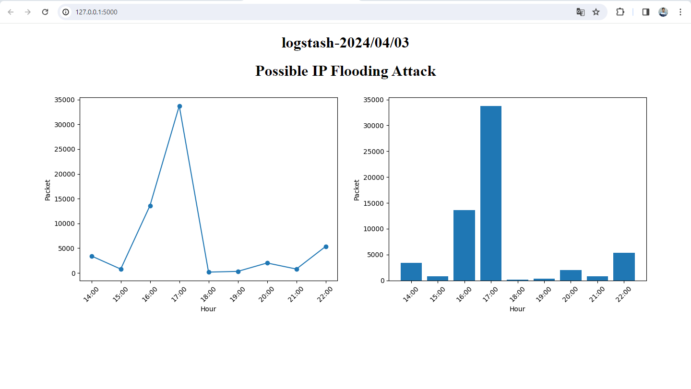

<h1 align="center">การติดตามและตรวจจับการโจมตีรูปแบบ IP Flood </h1>
<a href="https://youtu.be/7a5WHILv9g8?si=H1zcb4_viN3Jz7WL">Demo Project: Click Here</a> 
<h2>สมาชิกในกลุ่ม</h2>
<ul>
    <li>64100738 - กษิดิศ บุญชัย</li>
    <li>64106107 - ธัมมกิตติ์ โชติช่วง</li>
    <li>64107899 - ปณชัช เอี่ยมน้ำ</li>
    <li>64113889 - ศุภณัฐ คุ้มรักษ์</li>
    <li>64111412 - เมธานุสรณ์ สุทธิรัตน์</li>
    <li>64114069 - เศรษฐพงษ์ เคียนเขา</li>
</ul>
<h2 align="center">หน้า Website การแสดงผล</h2>
<p align="center">
        
    </p>
<h2 align="center">Command IP Flood</h2>
<p align="center">
    <code>sudo hping3 -S --flood -p 1000 &lt;IP Target&gt;</code>
</p>
<h2 align="center">โครงสร้างข้อมูลโดนการโจมตี</h1>
```
{
    {
        "src_mac": "2c:6d:c1:08:19:07",
        "in_interface": "wlp2s0",
        "dst_mac": "78:9f:70:79:dc:ce",
        "dst_ip": "172.28.3.108",
        "tags": [],
        "src_ip": "172.28.3.106",
        "hostname": "itd-Macmini",
        "@timestamp": "2024-04-03T15:47:40.132Z",
        "len": "40",
        "port": 47630,
        "@version": "1",
        "host": "172.18.0.1",
        "events": "Possible IP Flooding Attack",
        "timestamp": "Apr  3 22:46:03"
    }
}
```
